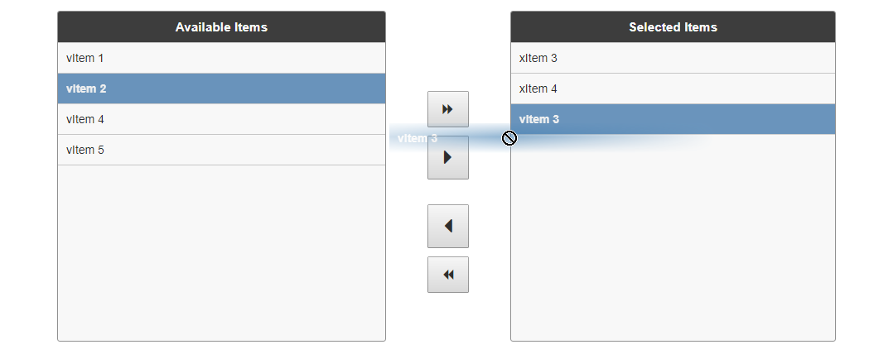

# Vue-Mover

A simple list picker vue-component, with drag and drop and sortable items.

> Note: this is a playground component as I'm experimenting and figuring out Vue. use at your own risk. [Feedback welcome](https://github.com/RickStrahl/vue-mover/issues).

* [Try it out](https://rawgit.com/RickStrahl/vue-mover/master/moverComponentSample.html)

Support:

* Moving items between two list displays
* Drag and drop or use movers
* Drag and drop sorting



### Syntax:
Inside of a Vue application use this markup:

```html
<script src="scripts/vue.min.js"></script>
<script src="scripts/Sortable.min.js"></script>    
<script src="vue-mover.js"></script>

<mover 
     target-id="MyMover"
     :left-items="selectedItems"
     :right-items="unselectedItems"
     titleLeft="Available Items"
     titleRight="Selected Items">
</mover>
```

where **left** and **right** items are array properties on the view model.

To set up the model load:

```
var vm = {
  pageTitle: "Vue Mover Component Sample",
  unselectedItems: [
    {
        value: "vitem1",
        displayValue: "vItem 1",
        isSelected: false
    },
    {
        value: "vitem2",
        displayValue: "vItem 2",
        isSelected: true
    },
    {
        value: "vitem3",
        displayValue: "vItem 3",
        isSelected: false
    },
    {
        value: "vitem4",
        displayValue: "vItem 4",
        isSelected: false
    },
    {
        value: "vitem5",
        displayValue: "vItem 5",
        isSelected: false
    }
  ],
  selectedItems: [
    {
        value: "xitem3",
        displayValue: "xItem 3",
        isSelected: false
    },
    {
        value: "xitem4",
        displayValue: "xItem 4",
        isSelected: false
    }
  ],    
  // demonstrate retrieving items
  saveItems: function() {
    var s = "";
    for (var i = 0; i < vm.selectedItems.length; i++) {
      var element = vm.selectedItems[i];
      s += element.displayValue + "\r\n";
    }

    alert('ready to save ' + vm.selectedItems.length + 
         ' items.\r\n' + s);
  }
} 

var app = new Vue({
      el: "#Body",
      data: function() { return vm; }
});
```

### Multiple Movers
You can drop multiple movers on the page. If you do be sure to give each mover a seperate `target-id`

```html
<mover :left-items="unselectedItems2" :right-items="selectedItems2"
       target-id="Mover2"></mover>  
```

and ensure that each has separate set of data sources for left and right items.

### Styling
You can override the styling of the various styles in the `vue-mover.css` style sheet. The mover overall should be self contained, but the height is probably one you'll want to adjust:

```html
<style>
    /* override panel height */
    #Mover .mover-panel {
        height: 500px;
    }
    #Mover2 .mover-panel {
        height: 300px;
    }
</style>
```

If you have multiple movers prefix your tags with the mover's target id to keep the CSS separate. The default ID is `Mover`.

### Dependencies

* [font-awesome](http://fontawesome.io)
* [sortable js](http://rubaxa.github.io/Sortable/)

### Build
Output is built with WebPack.

To build use:

```
npm run build
```
